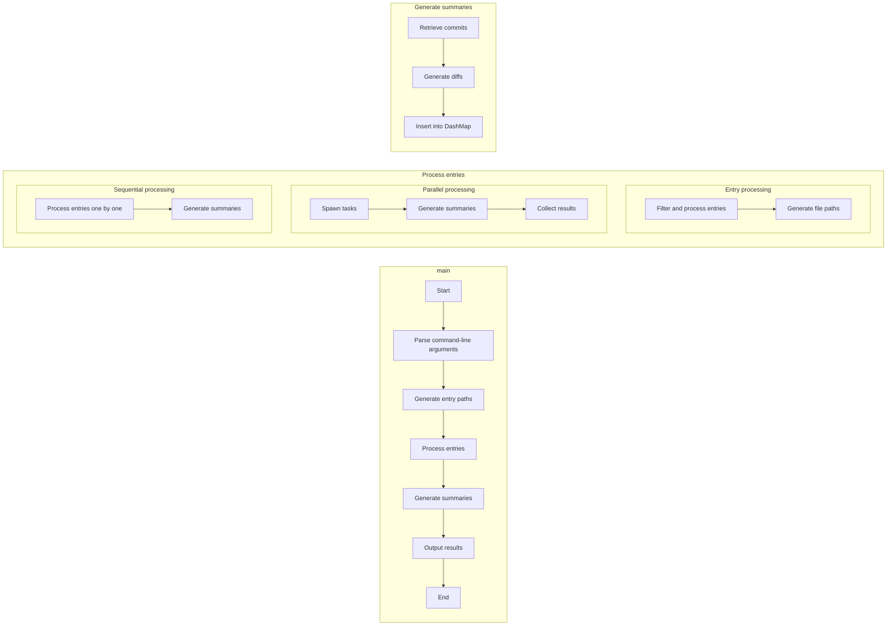
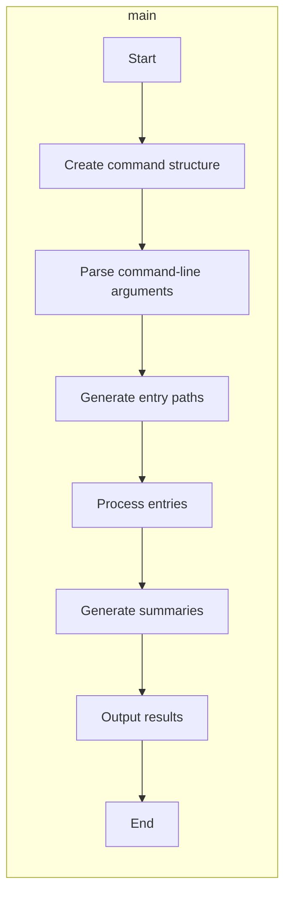
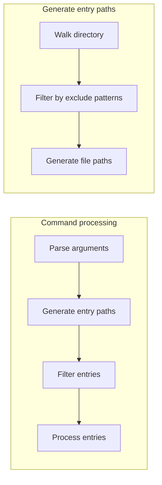
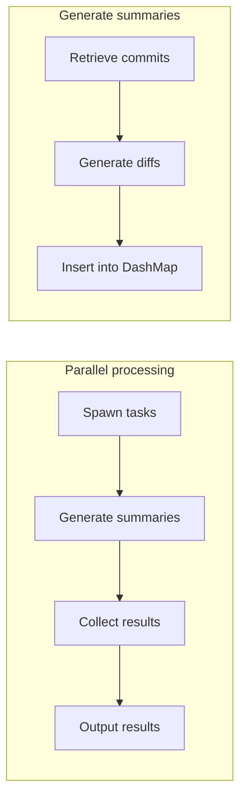
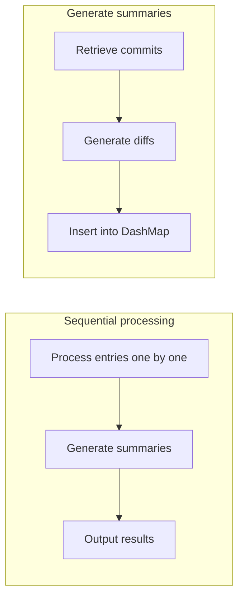
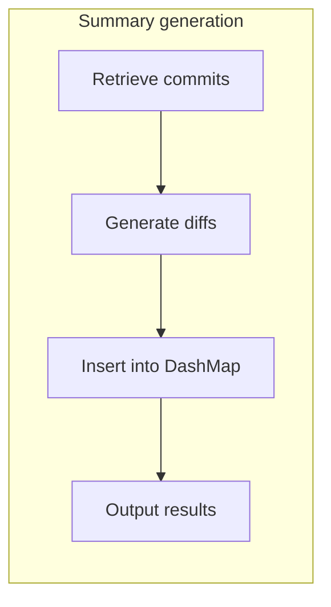
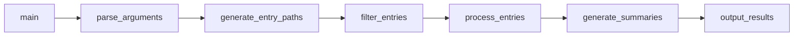
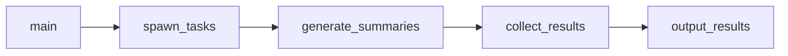
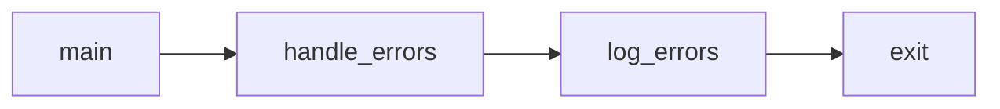
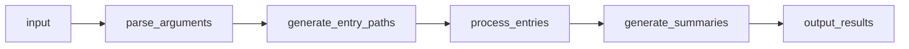

### **1. High-Level Overview**

This diagram shows the overall structure of the application, including the main
entry point, command processing, and execution flow.

---

### **2. Main Function Flow**

This diagram shows the control flow within the `main` function, including the
initialization of the command structure and the execution of the async function.

---

### **3. Command Processing Flow**

This diagram shows the flow of processing command-line arguments and generating
entry paths.

---

### **4. Parallel Processing Flow**

This diagram shows the flow of processing entries in parallel, including task
spawning and result collection.

---

### **5. Sequential Processing Flow**

This diagram shows the flow of processing entries sequentially, including
generating summaries and outputting results.

---

### **6. Summary Generation Flow**

This diagram shows the flow of generating summaries, including retrieving
commits, generating diffs, and inserting results into a DashMap.

---

### **7. Function Call Graph**

This diagram shows the relationships between major functions and their calls.

---

### **8. Concurrency Flow**

This diagram shows the concurrency model used in the parallel processing of
entries.

---

### **9. Error Handling Flow**

This diagram shows the error handling flow within the application.

---

### **10. Data Flow**

This diagram shows the data flow through the application, from input to output.

