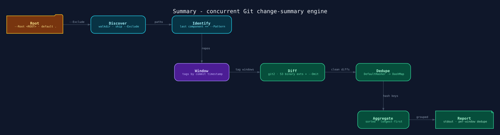
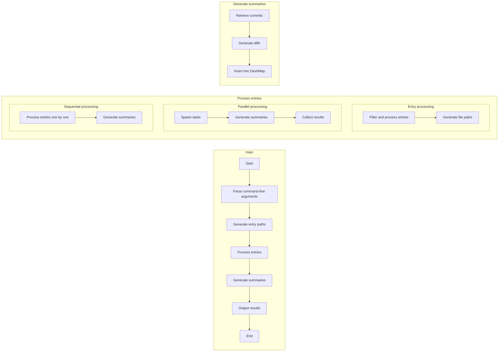

<p align="center">
  
</p>

---

# [Summary] 🗣️

> [!NOTE]
>
> **Concurrent Git change-summary engine.** Discovers every repository under a
> root directory, sorts its tags chronologically, and emits clean, deduplicated
> diffs for each release window - consecutive tags, latest tag to HEAD, or the
> entire history when a repository has no tags. Parallel by design: hundreds of
> repositories summarised in seconds. _One binary. Zero configuration. Read your
> whole fleet's history at a glance._

[](https://github.com/PlayForm/Summary/releases)
[](https://crates.io/crates/psummary)
[](https://www.rust-lang.org)
[](LICENSE)

---

## Install ⚡

**`Terminal`**

```sh
cargo install psummary
```

The crate is published as `psummary` and installs **two** binaries with
identical functionality:

- `Summary` - the primary binary
- `PSummary` - capitalized alias for case-insensitive filesystems

> [!IMPORTANT]
>
> The installed binaries are named `Summary` and `PSummary` - only the crate
> itself is called `psummary`.

### From source

**`Terminal`**

```sh
git clone https://github.com/PlayForm/Summary.git
cd Summary
cargo build --release
```

---

## The Problem 🔥

Summarising what changed across many repositories is a chore: open each repo,
list its tags, figure out which release pair matters, run `git diff`, and
repeat - then repeat again for the next tag, and again for the next repo.

`git diff` output itself is noisy: binary files, whitespace churn, lockfiles,
and changelogs drown out the changes that matter, and every repository repeats
the same manual ceremony.

`Summary` collapses the whole loop into one command. It walks a root directory,
finds every repository, builds the release timeline from tag timestamps, and
prints only the semantic changes - additions and deletions - grouped by release
window, deduplicated, and ordered longest-first.

---

## How It Works 🔄

**`Pipeline`**

```text
 ANY ROOT ───────► Summary ───────► stdout (grouped, deduplicated)
                      │
                      ├─ discover   → walkdir over --Root, skipping --Exclude
                      ├─ identify   → path whose last component matches --Pattern (.git)
                      ├─ window     → tags sorted by commit timestamp
                      │                • tag₁ → tag₂, tag₂ → tag₃, …
                      │                • latest tag → HEAD
                      │                • first commit → last commit (untagged repos)
                      ├─ diff       → git2 diff, 53 binary extensions + --Omit regex
                      └─ aggregate  → DashMap + DefaultHasher, dedupe, sorted print
```

Six steps, all in Rust:

1. **Discover** - `walkdir` traverses the filesystem from `--Root`, filtering
   entries against `--Exclude`; a segment whose name equals `--Pattern` is never
   excluded, so `.git` is always found - even inside `node_modules`.
2. **Identify** - repositories are paths whose last component matches
   `--Pattern` (default `.git`).
3. **Window** - each repository's tags are resolved to commit timestamps and
   sorted chronologically; diffs are generated between every consecutive tag
   pair, plus the latest tag to HEAD. Untagged repositories collapse to a single
   first-commit-to-last-commit window.
4. **Diff** - `git2::DiffOptions` with `indent_heuristic`, `minimal`,
   `force_text`, `ignore_filemode`, `ignore_case`, and the full
   `ignore_whitespace*` family; a `regex::RegexSet` of 53 built-in binary
   extensions plus user `--Omit` patterns drops unwanted files before output.
5. **Deduplicate** - each diff is hashed with
   `std::collections::hash_map::DefaultHasher` into a `DashMap`; identical diffs
   inside a window collapse to a single entry.
6. **Aggregate** - windows are grouped by their `🗣️ Summary from … in …` header,
   sorted alphabetically, and printed with the longest diffs first.

---

## Architecture 🏗️

**`Layout`**

```text
Source/
├── Library.rs                     ← #[tokio::main] entry point
├── Struct/
│   ├── Binary/
│   │   └── Command.rs             ← wiring: path separator, parallel/sequential dispatch
│   └── Summary/
│       └── Difference.rs          ← --Omit pattern holder
└── Fn/
    ├── Binary/
    │   ├── Command.rs             ← clap CLI definition (builder API)
    │   └── Command/
    │       ├── Entry.rs           ← walkdir discovery + --Exclude filtering
    │       ├── Parallel.rs        ← rayon scan + tokio tasks (FuturesUnordered)
    │       └── Sequential.rs      ← join_all fallback
    └── Summary.rs                 ← per-repo tag chronology + diff windows
        └── Summary/
            ├── Difference.rs      ← git2 diff options + regex omit + binary filter
            ├── Insert.rs          ← DashMap insertion, hashed key
            │   └── Hash.rs        ← std DefaultHasher
            ├── First.rs           ← first-commit revwalk (topological, reversed)
            └── Group.rs           ← dedupe, sort, print
```

| Mode                 | Discovery               | Per-repo work                               | Failure handling               |
| :------------------- | :---------------------- | :------------------------------------------ | :----------------------------- |
| Parallel (`-P`)      | rayon `into_par_iter()` | tokio `spawn()` + `FuturesUnordered` → mpsc | logged to stderr, continues    |
| Sequential (default) | plain iteration         | `futures::join_all` of async per-repo tasks | errors collected, repo skipped |

All diffing is done in-process via `git2` - no shelling out to `git`.



---

## Usage ⚙️

**`Terminal`**

```text
Summary 🗣️

Usage: Summary [OPTIONS]

Options:
  -P, --Parallel           Parallel ⏩
  -R, --Root <ROOT>        Root 📂 [default: .]
  -E, --Exclude <EXCLUDE>  Exclude 🚫 [default: node_modules]
      --Pattern <PATTERN>  Pattern 🔍 [default: .git]
  -O, --Omit <OMIT>        Omit 🚫 [default: (?i)documentation (?i)target (?i)changelog\.md$ (?i)summary\.md$]
  -h, --help               Print help
  -V, --version            Print version
```

### Examples

**1. Summarise every repository under the current directory**

**`Terminal`**

```sh
Summary -P
```

**2. Scan a projects folder and save the report**

**`Terminal`**

```sh
Summary -P -R ~/Developer > changes.diff
```

**3. Skip common build directories**

**`Terminal`**

```sh
Summary -P -E "node_modules target dist"
```

### What it produces

Run against this repository itself, `Summary` emits one block per release
window - each headed by `🗣️ Summary from <start> to <end> in <repo>`, where
`<repo>` is the path relative to `--Root`:

**`Output`**

```diff
🗣️ Summary from Summary/v0.0.1 to Summary/v0.0.2 in .
diff --git a/Cargo.toml b/Cargo.toml
index 745ad03..c769c35 100644
--- a/Cargo.toml
+++ b/Cargo.toml
- version = "0.0.1"
+ version = "0.0.2"
```

A single window can span many files at once - this one between v0.0.2 and v0.0.3
captures a build-script reformat, a dependency addition, and a version bump in
one pass (the full window also touches `README.md` and
`Source/Fn/Binary/Command.rs`):

**`Output`**

```diff
🗣️ Summary from Summary/v0.0.2 to Summary/v0.0.3 in .
diff --git a/build.rs b/build.rs
index 73ccc94..1f0de60 100644
--- a/build.rs
+++ b/build.rs
- use serde::Deserialize;
- use std::fs;
-
+
+ use serde::Deserialize;
+ use std::fs;
diff --git a/Cargo.toml b/Cargo.toml
index c769c35..c10016a 100644
--- a/Cargo.toml
+++ b/Cargo.toml
+ regex = "1.10.5"
- version = "0.0.2"
+ version = "0.0.3"
```

The newest window of a tagged repository reads
`Summary from <latest> to last commit`; an untagged repository collapses to
`Summary from first commit to last commit`.

> [!WARNING]
>
> The output is a lossy summary, not a patch: hunk headers, context lines, and
> binary content are stripped, so it cannot be fed to `git apply`. It is a
> reading aid, not a replay mechanism.

---

## Configuration 🎛️

Everything lives on the command line - no config file, no environment setup.

| Option                    | Meaning                                                      | Default                                                            |
| :------------------------ | :----------------------------------------------------------- | :----------------------------------------------------------------- |
| `-P, --Parallel`          | enable parallel mode                                         | off (sequential)                                                   |
| `-R, --Root <ROOT>`       | directory to start scanning from                             | `.`                                                                |
| `-E, --Exclude <EXCLUDE>` | space-separated directory names to skip                      | `node_modules`                                                     |
| `--Pattern <PATTERN>`     | last path component that marks a repository                  | `.git`                                                             |
| `-O, --Omit <OMIT>`       | repeatable regex; matching files are dropped from every diff | `(?i)documentation (?i)target (?i)changelog\.md$ (?i)summary\.md$` |

> [!IMPORTANT]
>
> `--Exclude` splits on spaces and matches as a substring of any path segment
>
> - but a segment whose name equals `--Pattern` is never excluded, so `.git` is
>   always discovered, even inside `node_modules`. `--Pattern` matches the
>   **last path component only**, which is what makes `.git` work.

> [!TIP]
>
> Only **local** tags are analysed. Run `git fetch --tags` first to include
> remote tags. `--Omit` patterns are case-sensitive by default; prefix with
> `(?i)` for case-insensitive matching (the built-in defaults already do).

**`Terminal`**

```sh
# Skip lockfiles, markdown files, and dist folders entirely
Summary -P -O ".*\.lock$" -O "(?i)\.md$" -O "/dist/"
```

---

## Performance 📊

`Summary` processes repositories concurrently, making it dramatically faster
than running sequential git commands manually. In typical scenarios scanning
100+ repositories:

| Operation                  | Parallel Time | Sequential Time | Speedup  |
| :------------------------- | :-----------: | :-------------: | :------: |
| Generate tag diffs         | ~2-3 seconds  | ~15-20 seconds  | **6-8x** |
| Diff all commits (no tags) | ~2-3 seconds  | ~12-18 seconds  | **6-8x** |

_(Actual performance depends on repository count, sizes, and I/O speed)_

The parallelism splits naturally: rayon handles the CPU-bound path scan, tokio
spawns one async task per repository, and `DashMap` aggregates without lock
contention.

---

## Dependencies 🖇️

`Summary` is built with these excellent Rust crates:

- **[`clap`](https://crates.io/crates/clap)** - ergonomic command-line parsing
  (builder API)
- **[`git2`](https://crates.io/crates/git2)** - libgit2 bindings: repositories,
  tags, trees, diffs
- **[`rayon`](https://crates.io/crates/rayon)** - data-parallel path scanning
- **[`tokio`](https://crates.io/crates/tokio)** - async runtime (`full`) for
  concurrent diff generation
- **[`walkdir`](https://crates.io/crates/walkdir)** - efficient cross-platform
  directory traversal
- **[`regex`](https://crates.io/crates/regex)** - `RegexSet` for omit patterns
  and binary extensions
- **[`dashmap`](https://crates.io/crates/dashmap)** - sharded concurrent hash
  map for lock-free aggregation
- **[`futures`](https://crates.io/crates/futures)** - `FuturesUnordered` and
  `join_all` task orchestration
- **[`chrono`](https://crates.io/crates/chrono)** - tag timestamp resolution and
  chronology
- **[`itertools`](https://crates.io/crates/itertools)** - `sorted_by`,
  `sorted_by_key` result ordering

Build-time: [`serde`](https://crates.io/crates/serde) (derive) and
[`toml`](https://crates.io/crates/toml) stamp the package version into the
binary via `build.rs`.

> [!NOTE]
>
> `num_cpus` and `unbug` are declared in `Cargo.toml` but not referenced by the
> source - they are listed for completeness only.

---

## Binary Extensions 📦

`Summary` automatically excludes these **53** binary file types from diffs using
case-insensitive patterns:

```text
.7z .accdb .avi .bak .bin .bmp .class .dat .db .dll .dll.lib .dll.exp
.doc .docx .dylib .exe .flac .gif .gz .heic .ico .img .iso .jpeg .jpg
.m4a .mdb .mkv .mov .mp3 .mp4 .o .obj .ogg .pdb .pdf .png .ppt .pptx
.pyc .pyo .rar .so .sqlite .svg .tar .tiff .wav .webp .wmv .xls .xlsx .zip
```

The filter operates on file paths only - content is never inspected. The full
list lives in
[`Source/Fn/Summary/Difference.rs`](Source/Fn/Summary/Difference.rs).

---

## Contributing 🤝

| Want to…          | Start here                                                                               |
| ----------------- | ---------------------------------------------------------------------------------------- |
| Report a bug      | [Open an issue](https://github.com/PlayForm/Summary/issues/new)                          |
| Suggest a feature | [Start a discussion](https://github.com/PlayForm/Summary/discussions/new?category=ideas) |
| Submit a PR       | [Fork & open a PR](https://github.com/PlayForm/Summary/pulls)                            |
| Ask a question    | [Discussions Q&A](https://github.com/PlayForm/Summary/discussions/new?category=q-a)      |

Please read [`CONTRIBUTING.md`](CONTRIBUTING.md) and
[`CODE_OF_CONDUCT.md`](CODE_OF_CONDUCT.md) first. No contribution is too small -
first-time contributors are especially welcome.

---

## License 📜

Released under [CC0-1.0](LICENSE) - public domain. Use, modify, distribute, and
build upon it freely.

---

_Built with ❤️ by PlayForm._

[Summary]: https://github.com/PlayForm/Summary
